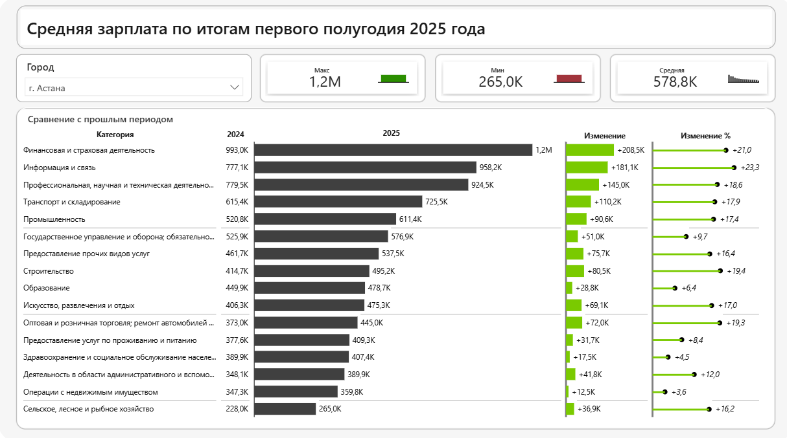

# 📊 Power BI Projects

В этом разделе представлены проекты по аналитике и визуализации данных в Power BI.

---

## 1️⃣ Отчёт по средней заработной плате по отраслям   
[🔗 Открыть в Power BI Service](https://app.powerbi.com/view?r=eyJrIjoiMjRlYTdlNjEtMDk0MS00MTI4LWE5MGItMmFhYzA3NDg1MTEyIiwidCI6IjZlZWVhZjNlLTY3MTItNDhhNC05NzY3LTNmY2E1NGUxMTc1YyIsImMiOjl9)

### 📌 Ключевые выводы

- Средняя зарплата: **578,8 тыс. тг**
- Диапазон: **265 тыс. – 1,2 млн тг**
- Рост зафиксирован во всех отраслях

#### Лидеры по уровню дохода
- Финансовая и страховая деятельность – **1,2 млн тг**
- Информация и связь – **958,2 тыс. тг**
- Профессиональная и научная деятельность – **924,5 тыс. тг**

#### Структурные особенности
- Разрыв между максимумом и минимумом превышает **4,5 раза**
- Максимальный рост наблюдается в финансовом и IT-секторе
- Социальные отрасли демонстрируют более сдержанную динамику

**Business Insight:**  
Рост доходов в коммерческих и цифровых секторах усиливает дифференциацию рынка труда и конкуренцию за квалифицированные кадры.

---

## 2️⃣ Financial Dashboard  
*(в разработке)*

---

## 3️⃣ HR Analytics  
*(в разработке)*

---

## ⚙️ Технологии
- Power BI Desktop / Service  
- Power Query  
- DAX  
- SQL / Excel / 1С  

---

## 📬 Контакты
✉️ **dramirchi777@gmail.com**  
💼 [LinkedIn](https://www.linkedin.com/in/bekbassynov)  
🖥 [GitHub](https://github.com/Dazmand23)
